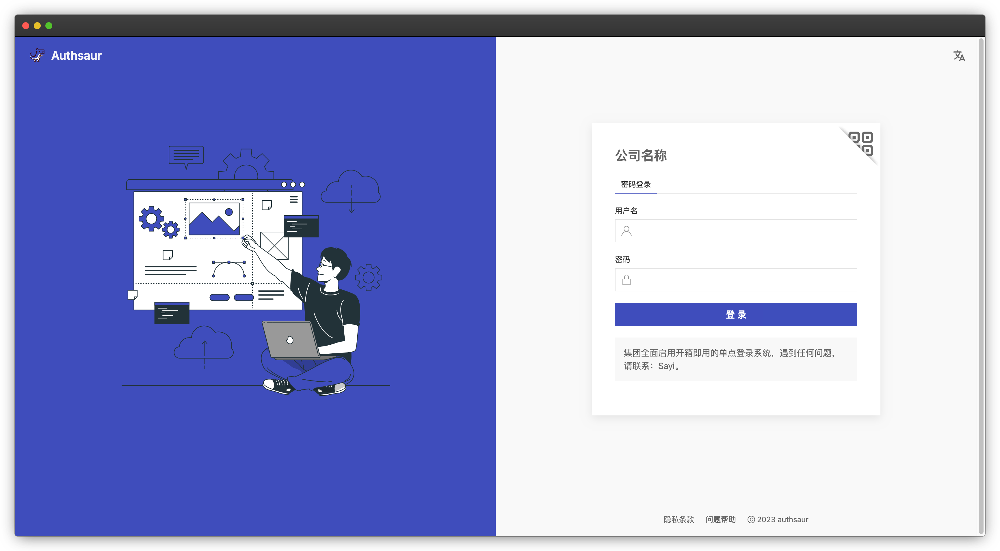

  

      
  

Authsaur，面向所有人的企业单点登录，让每个企业拥有开箱即用的私有身份云。

 
  
  
  

## What's Authsaur?
Authsaur帮助更多企业统一和构建标准化的用户身份体系，基于数十年优秀开源方案CAS，打造**开箱即用**的企业级单点登录系统。

- 应用市场，多协议支持：CAS、SAML、OAuth2、OpenID Connect等
- 应用单点登录插件化，快速接入非标准协议的应用，比如禅道、腾讯企业邮等
- 可插拔的认证：LDAP、钉钉、Radius、短信、邮箱等
- 双因素认证：Google Authenticator、短信等
- 第三方认证：Facebook、Twitter、GitHub、微博等
- 支持多身份源，也支持多身份源关联
- 5A建设：用户Account、认证Authentication、应用Application、授权Authority和审计Audit
- 品牌定制：LOGO、主题色、登录页排版布局、文案都可定制
- 国际化支持：中文、英文，更多语言切换
- 跨平台跨语言客户端集成：Java、C++、Golang、Nodejs等
- 快速部署：基于Docker安装，只需5分钟

